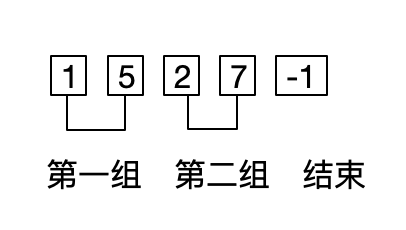

# C和指针读书笔记

> 题目1
> 
> 从标准输入中读取输入行并在标准输出中打印这些输入行。
> 输入的第一行是一串列标号，串的最后以一个负数结尾。
> 这些列标号成对出现，说明需要打印的输入行的列范围。
> 

* 分解题目

1. 从第一行中读取一串列标号,如下图中，输出第1列到第5列，第2列到第7列的字符。



考虑的限制条件：

* 需要成对的读取
* -1作为结束符需要丢弃
* 该行-1后面的数需要丢弃
* 每组标识后面的比前面大
* 每组后面标记如果大于输入行数组，需要处理

实现这部分代码功能

```c
//columns数组用来存放输入的列标识，max标记最大可以输入多少列标识
int read_column_numbers(int columns[], int max)
{
    int num = 0;
    int ch;
    //num计数，读取的标识数不能超过最大值，
    while (num < max && scanf("%d", &columns[num]) == 1 && columns[num] >= 0)
    {
        num++;
        //检查每一对列标识中，后面的比前面大
        if (num % 2 == 0)
        {
            if (columns[num - 1] < columns[num - 2])
            {
                puts("column number is not right");
                exit(EXIT_FAILURE);
            }
        }
    }
    //检查读取的标识数必须是偶数
    if (num % 2 != 0)
    {
        puts("Last column number is not paired.");
        exit(EXIT_FAILURE);
    }
    //过滤掉同一行中-1后面全部的数据内容
    while ((ch = getchar()) != EOF && ch != '\n')
    {
    }
    return num;
}
```

2.对每行字符串进行编排

```c
/**
 * @brief 处理一行的数据，将input的字符串，根据columns标记的位置
 * 输出到output中
 * 
 * @param output 输出
 * @param input 输入
 * @param n_columns 列标识的个数
 * @param columns 列标识数组
 */
void rearrange(char *output, char const *input,
               int n_columns, int const columns[])
{
    int col;
    int output_col;
    int len;

    len = strlen(input); //计算input字符串的长度
    output_col = 0;

    for (col = 0; col < n_columns; col += 2) //取columns数组中每两个数据的值
    {
        int nchars = columns[col + 1] - columns[col] + 1; //计算截取字符串长度

        //边界条件判断
        if (columns[col] >= len || output_col == MAX_INPUT - 1)
            break;
        //对最大长度的限制
        if (output_col + nchars > MAX_INPUT - 1)
            nchars = MAX_INPUT - output_col - 1;
        //复制字符串
        strncpy(output + output_col, input + columns[col], nchars);
        //标记结尾处的列号
        output_col += nchars;
    }
    //字符串后补0
    output[output_col] = '\0';
}
```

3.对多个输入字符串进行循环处理

```c
  while (gets(input) != NULL)
    {
        printf("Original input : %s\n", input);
        rearrange(output, input, n_columns, columns);
        printf("Rearraged line: %s\n", output);
    }

```


